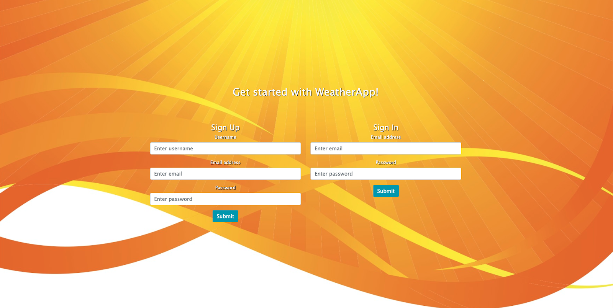

  

<h1 align="center">WeatherApp Daily</h1>

 </a>

## :newspaper: About 

Weather App is an application that will allow you to display the weather of cities that you have previously entered.

## :spiral_notepad: Specificities 

- a responsive user interface
- a user login system
- possibility to register a new city
- display the weather information of a city in real time
- persistent information of a user (even after a cut of the server)
- interactive map of the entered cities.

## :fire: Credits 

- Project logo : <a href="https://www.flaticon.com/free-icons/weather" title="weather icons">Weather icons created by Freepik - Flaticon</a>
- Project realized during the <a href="https://www.lacapsule.academy/">La Capsule Academy</a> bootcamp

  
  
  

